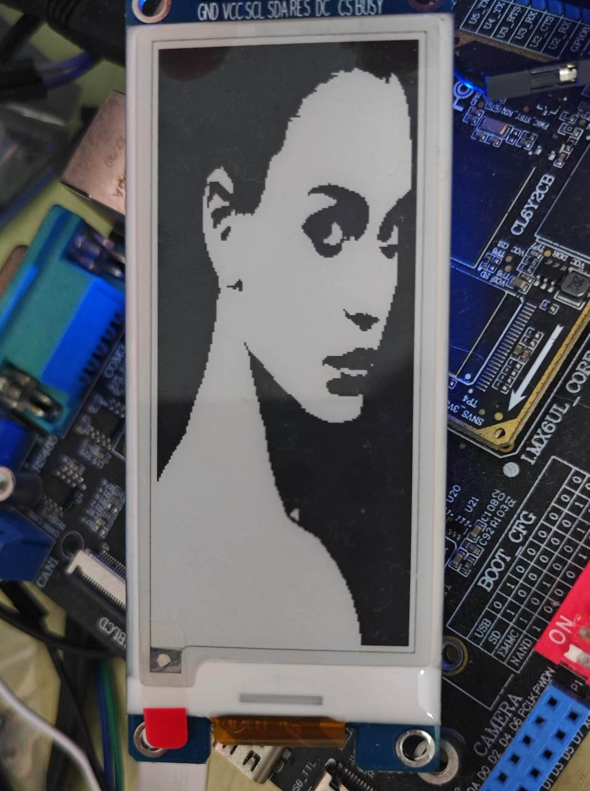
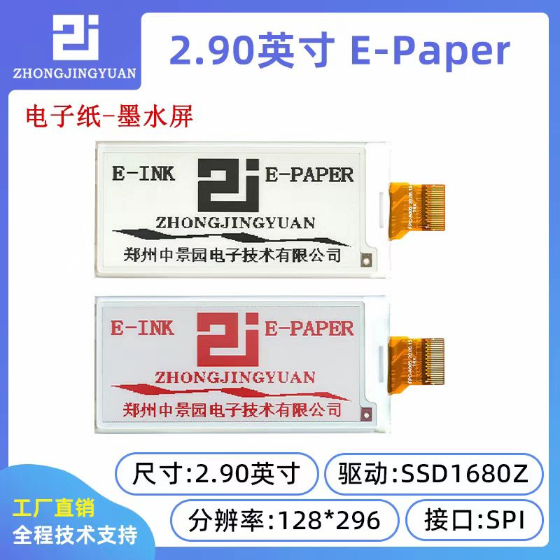

# 2.90英寸 E-Paper电子屏/水墨屏
## 成品展示




## 硬件说明
- SPI 3线8bits单向协议。
- 6个pins，2个电源，三个spi，1个用来区分发送的是数据还是命令。



## 软件说明
- 设备层使用linux spi框架给出的用来给设备发送数据的API。
- 采用framebuffer作为用户层接口。
- 用户层采用python代码将图片按照固定格式转换之后发给/dev/fb0。

## 使用说明
1. 配置dts，注意spi控制器对CS pin的限制。
2. 编译驱动代码并安装。
3. 使用如下命令查看脚本使用说明。
```python
python3 img2fb.py --help
```

## 补充
- 用户层再往上搭建一层只显示文字，可以选用freetype，该库可以解析ttf文件，并生成图片，有C库以及对应的python wrapper。
- 再往上搭建一层可参考代码 [[https://github.com/breakstring/eInkCalendarOfToxicSoul]]
